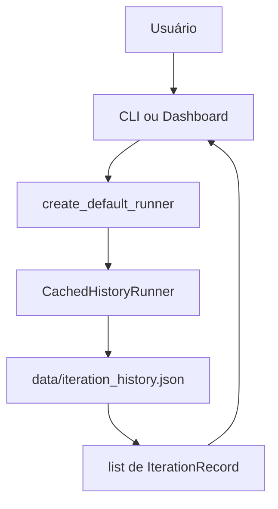
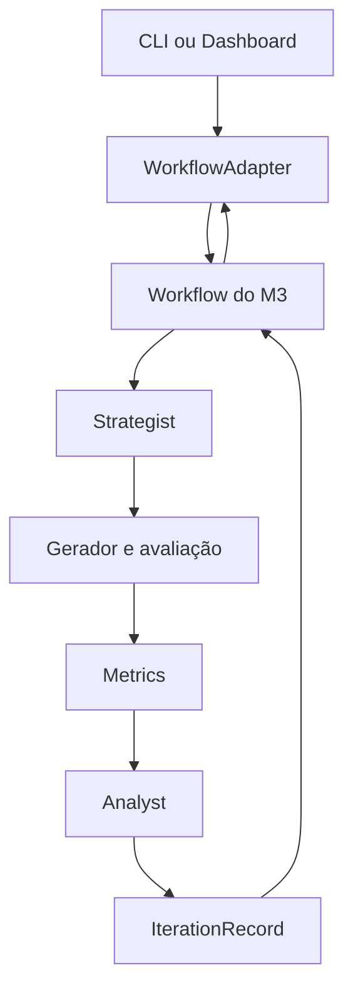

# Arquitetura do sistema

## Visão geral

O Laboratório Inteligente avalia um IDS baseado em Random Forest sobre tráfego
sintético de Smart Grids. O desenho alvo possui um Strategist que propõe
alterações, um núcleo que gera/avalia datasets e um Analyst que interpreta as
métricas. CLI e dashboard são camadas de apresentação.

No estado atual, as interfaces operam sobre um histórico golden. Strategist e
Analyst reais estão implementados, mas o workflow Agno Team que deve encadeá-los
ainda não está disponível.

## Princípios

- separação entre domínio, núcleo, agentes e interfaces;
- modelos Pydantic como contratos entre membros;
- interfaces dependentes de uma porta, não de detalhes do Agno;
- modo cacheado para reprodutibilidade sem Java;
- fixtures e stubs identificados explicitamente como recursos de teste;
- segredos mantidos fora do versionamento.

## Fluxo atual



Esse fluxo não chama agentes, Groq ou Java. O golden foi produzido previamente
pelo script cacheado usando stubs determinísticos.

## Fluxo alvo, ainda pendente



O diagrama acima representa a integração planejada, não uma funcionalidade já
disponível. A futura função pública deverá aceitar `iterations`, `model_id` e
`generator_mode` e devolver registros compatíveis com `IterationRecord`.

## Componentes

### Domain

| Tipo | Responsabilidade | Campos principais |
|---|---|---|
| `AttackConfig` | Configuração validada do ataque sintético | `fault`, `cbStatus`, `ttlMsValues`, `analog`, `trapArea` |
| `Metrics` | Resultado da avaliação do IDS | F1, precisão, recall, TP, FP, FN, TN e importâncias |
| `AnalystOutput` | Saída estruturada e validada do Blue Team | iteração, features, diagnóstico, mitigações e severidade |
| `IterationRecord` | Unidade do histórico | iteração, configuração, métricas, saídas dos agentes e timestamp |

`analyst_output` já utiliza `AnalystOutput | None`. `strategist_output` ainda é
um dicionário opcional enquanto o contrato definitivo do Strategist não está
integrado.

### Agents

#### Strategist

`agents/strategist/agent.py` cria um `agno.agent.Agent` com modelo Groq. Ele
recebe prompt, configuração, métricas e histórico e devolve texto com mudanças
aplicáveis. O contrato tipado `StrategistOutput` planejado ainda não existe.

#### Analyst

`agents/analyst/agent.py` cria um agente Agno/Groq com saída
`AnalystOutput`. As ferramentas selecionam importâncias, calculam severidade e
rejeitam features ou valores sem respaldo nas métricas. O golden continua
contendo uma saída compatível produzida por `FakeAnalyst`.

#### Orchestrator

`agents/orchestrator/workflow.py` é placeholder. O contrato de integração já
existe em `interfaces/experiment_runner.py`:

```python
runner.run(
    iterations=...,
    model_id=...,
    generator_mode=...,
) -> list[IterationRecord]
```

`WorkflowAdapter` normaliza dicionários ou modelos retornados pelo workflow real
(`agents/orchestrator/live.py::run_live_workflow`). `create_default_runner(engine)`
é o único ponto de troca: `demo` (default) devolve o runner golden; `live` embrulha
o loop real no `WorkflowAdapter`.

### Dataset e avaliação

`GeneratorRunner` oferece:

- `cached`: copia `data/baseline_dataset.csv`, sem subprocesso Java;
- `jar`: grava a configuração, executa o JAR e copia o dataset gerado.

`IdsEvaluator` usa pandas e scikit-learn para treinar o Random Forest no
baseline, transformar features e produzir métricas. A matriz binária é
persistida como `tn`, `fp`, `fn` e `tp`.

### Interfaces

#### CLI

`interfaces/cli.py` interpreta argumentos, chama `ExperimentRunner`, trata
interrupções/erros e apresenta um resumo. Não cria agentes nem calcula métricas.

#### Dashboard

`interfaces/dashboard/app.py` guarda registros em `st.session_state` e apresenta
F1, matriz, diferenças de `AttackConfig`, tabela e saída do Analista. As funções
de preparação são transformações de apresentação e possuem testes próprios.

## Modos de execução

| Modo | Implementação atual | Dependências | Finalidade |
|---|---|---|---|
| Golden cacheado | CLI e dashboard | Python e fixture | Demo previsível |
| Pipeline cacheado com stubs | `generate_golden_history.py` | Seed, pandas e scikit-learn | Regenerar golden |
| ERENO `jar` | `GeneratorRunner` | Java e JAR externo | Gerar novo dataset |
| Workflow real (Agno Team) | `live.py` via `--engine live` (route mode) | Agno, Groq, Strategist e Analyst | Loop completo |
| Workflow real (direto) | `--engine live --orchestration direct` | Agno, Groq | Fallback sem time |

## Configuração

`config/settings.py` carrega `.env` antes de avaliar configurações. Os principais
valores são:

- `GROQ_API_KEY`: credencial consumida pelo cliente Groq;
- `MODEL_ID`: modelo padrão da CLI;
- `GENERATOR_MODE`: `cached` ou `jar`;
- `RANDOM_SEED=42`: reprodutibilidade do avaliador;
- caminhos de inputs, outputs, seed, golden e runtime.

Argumentos da CLI sobrescrevem modelo, iterações e modo no contrato da
interface. No runner golden, o modelo não altera resultados.

## Dependências externas

| Dependência | Uso |
|---|---|
| Agno | abstração dos agentes e futura equipe |
| Groq | inferência dos agentes Strategist e Analyst reais |
| pandas | datasets e tabelas do dashboard |
| scikit-learn | Random Forest e métricas |
| Pydantic | contratos do domínio |
| Streamlit | dashboard acadêmico |
| SHAP | explicações opcionais de importância de features |
| Java/JAR ERENO | geração fora do modo cacheado |

## Decisões arquiteturais

- layout `src/` evita imports acidentais da raiz;
- instalação editável mantém entry point e pacote alinhados;
- `ExperimentRunner` desacopla interfaces do workflow ainda instável;
- o golden permite demonstração antes da integração dos agentes;
- Streamlit utiliza somente dependências já declaradas;
- código de apresentação não treina modelos nem executa agentes.

## Limitações e evolução

Concluído na integração da Fase 2:

- Strategist, avaliação e Analyst reais encadeados (`live.py`);
- loop real persistido como `IterationRecord`;
- `create_default_runner()` liga `demo`/`live` ao `WorkflowAdapter`;
- execução ao vivo no dashboard e modo `jar` pela CLI;
- agentes reais compostos num `agno.team.Team` em modo `route`
  (`build_agno_team` + `TeamStrategist`/`TeamAnalyst`): o líder encaminha ao
  membro e o orquestrador recupera a saída estruturada de `member_responses`,
  mantendo o núcleo determinístico entre as duas chamadas do time. É o default de
  `--engine live`; `--orchestration direct` mantém o encadeamento sem time.

Ainda em aberto:

- atualizar docstrings antigas que ainda atribuem lógica à CLI.
