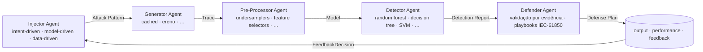

# Arquitetura — os cinco agentes do pipeline intent-driven

Esta é a arquitetura alvo do ERENO-AI e o que o código implementa hoje. Ela
corrige uma ausência do diagrama que circulava até 01/10/2026: o **Defender** é
a quinta caixa, entre o Detector e a realimentação — não um detalhe do bloco de
feedback.

## O desenho

```mermaid
flowchart LR
    I[Injector Agent<br/>intent-driven · model-driven · data-driven]
    G[Generator Agent<br/>cached · ereno · …]
    P[Pre-Processor Agent<br/>undersamplers · feature selectors · …]
    D[Detector Agent<br/>random forest · decision tree · SVM · …]
    B[Defender Agent<br/>validação por evidência · playbooks IEC-61850]
    F[(output · performance · feedback)]

    I -- Attack Pattern --> G
    G -- Trace --> P
    P -- Model --> D
    D -- Detection Report --> B
    B -- Defense Plan --> F
    F -- FeedbackDecision --> I
```

## Por que o Defender é uma caixa, e não parte do feedback

O bloco de feedback é **determinístico**: `core/feedback_policy.py` lê o
`DetectionReport` e o `DefensePlan` da rodada e deriva a intenção da próxima
sem chamar LLM nenhuma (epic E10). O Defender é outra coisa — é um **agente**,
com modelo, prompt e validador próprios, que produz um artefato que ninguém
mais produz:

- `agents/defender/` gera um `DefensePlan` a partir do `DetectionReport`;
- `agents/defender/tools.py::validate_plan_against_report` recusa o plano que
  invente chave de métrica ou de feature, altere um valor, aponte para outro
  relatório, ou declare uma prioridade que o relatório não sustenta;
- `core/defense_rules.py`, sobre o catálogo de `config/defense_techniques.py`,
  pergunta a pergunta seguinte: cada técnica recomendada **responde** à
  evidência que ela mesma cita? O resultado é persistido como
  `DefenseRuleReport`/`defense_rules.json`.

Colapsar isso em "(output, performance, feedback)" apagaria o único estágio do
pipeline em que uma saída de LLM é confrontada com a realidade medida **e** com
um catálogo de contramedidas — e é metade do argumento Red×Blue do projeto. Ver
`docs/defender_validation.md`.

## Os estágios, e o que cada um produz

| estágio | produz | determinístico? |
|---|---|---|
| `intent` | `IntentSpec` | não — é o LLM, atrás de dois portões |
| `compiler` | `AttackCandidate` (o *Attack Pattern*) | sim |
| `generator` | o trace (CSV) | sim, dado o backend e a seed |
| `preprocess` | `DatasetBundle` | sim |
| `detector` | `DetectionReport` | sim |
| `defender` | `DefensePlan` + `DefenseRuleReport` | não — é o LLM, atrás do validador |
| `feedback` | `FeedbackDecision` | sim |

Só **dois** estágios chamam uma LLM, e os dois têm um portão determinístico
logo atrás. É o guardrail central do projeto: o modelo produz a intenção ou o
plano de defesa; todo o resto é Python que decide se aquilo é executável.

### Nota sobre os nomes (`schema_version` 2)

Até a v1 do `LoopRecord`, `generator` nomeava a etapa de **compilação** e
`ereno` a de geração — um estágio com o nome de um backend dentro de uma
arquitetura de backends plugáveis. Na v2 são `compiler` e `generator`. Ledgers
da v1 são recusados com a razão; eles vivem em `outputs/`, que é descartável.

## O que é plugável hoje, e o que não é

| caixa | estratégias registradas | como se escolhe |
|---|---|---|
| Injector | `intent` (e o loop legado Strategist, em pipeline separado) | `--engine` |
| Generator | `cached`, `jar` | `--generator-mode`, registro em `core/generators.py` |
| Pre-Processor | seletor `none`/`mutual_info`; undersampler `none`/`random` | env var, **desligados** por default |
| Detector | `random_forest`, `decision_tree`, `svm_linear`, `svm_rbf` | `--detector`, registro em `core/detectors.py` |
| Defender | um | — |

Duas observações honestas sobre esta tabela:

**O Injector não é um registro.** `--engine demo|live|intent` troca o pipeline
inteiro, não uma estratégia de injeção atrás de um contrato comum. Unificar
intent-driven, model-driven e data-driven sob uma interface só é trabalho de
desenho, não de refactor.

**O Pre-Processor não decide nada.** Chamá-lo de *agente* sugere algo que
escolhe o undersampler e o seletor conforme o caso; hoje são
`FEATURE_SELECTION_MODE` e `UNDERSAMPLING_MODE`, chaves de ambiente desligadas
por padrão. A ressalva vale mais que a lacuna: um laço que ajusta o próprio
pré-processamento até a métrica melhorar deixa de medir o que o detector
enfrenta. Se essa caixa virar decisória, a decisão precisa ser auditável e
ficar fora do que o laço otimiza.

## Proveniência de uma rodada

Quatro manifests gravados lado a lado no diretório da execução respondem, dos
artefatos e sem reexecutar nada, de onde cada número veio:

| arquivo | responde |
|---|---|
| `generator_manifest.json` | de onde o trace veio, com que seed, se ele **varia com a config** |
| `feature_manifest.json` (E6) | como as features foram preparadas, sobre quais linhas |
| `selection_manifest.json` (E7) | quais sobreviveram, antes e depois do undersampling |
| `detector_manifest.json` (E8) | qual modelo aprendeu, com quais hiperparâmetros e qual escala |

Ao lado deles, `dataset_bundle.json` diz *o que está* no trace e
`detection_report.json` *quão bem* o detector foi. A divisão é proposital: os
manifests descrevem o processo, os relatórios descrevem o resultado, e só os
dois juntos tornam uma diferença entre execuções atribuível a alguma coisa.

## Princípios

- separação entre domínio, núcleo, agentes e interfaces;
- modelos Pydantic como contratos entre as camadas;
- interfaces dependem de uma porta (`ExperimentRunner`), não de detalhes do Agno;
- modo cacheado para reprodutibilidade sem Java;
- fixtures e stubs identificados explicitamente como recursos de teste;
- segredos mantidos fora do versionamento.

## Modos de execução

| modo | como se chama | dependências |
|---|---|---|
| Golden cacheado | `--engine demo` (default) | nenhuma além do Python |
| Loop legado Strategist↔Analyst | `--engine live` | Agno, Groq |
| Loop legado sem time Agno | `--engine live --orchestration direct` | Agno, Groq |
| Pipeline intent-driven | `--engine intent --prompt "..."` | Agno, Groq |
| Geração física | `--generator-mode jar` | Java + o JAR do ERENO |

Os três primeiros produzem `IterationRecord`; o intent-driven produz
`LoopRecord`, que é outro contrato e não passa pelo `ExperimentRunner`.

## Dependências externas

| dependência | uso |
|---|---|
| Agno | abstração dos agentes e do time |
| Groq | inferência dos agentes reais |
| pandas | datasets e tabelas |
| scikit-learn | detectores, preprocessamento e métricas |
| Pydantic | contratos do domínio |
| Streamlit (`--extra dashboard`) | dashboards |
| SHAP (`--extra shap`) | explicações opcionais, só para detectores de árvore |
| Java + JAR do ERENO | geração fora do modo cacheado |

## Decisões arquiteturais

- layout `src/` evita imports acidentais da raiz;
- `ExperimentRunner` desacopla as interfaces do workflow;
- o golden permite demonstrar e testar sem Groq nem Java;
- código de apresentação não treina modelos nem executa agentes;
- cada estratégia plugável (gerador, detector) é um registro por chave com
  manifesto por execução, e não uma cadeia de `if`.
